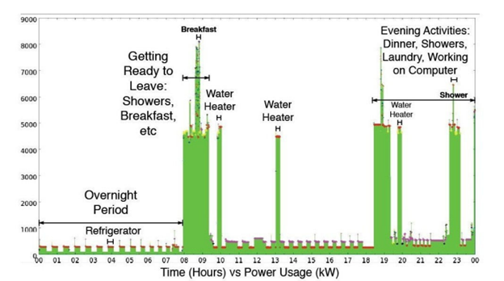
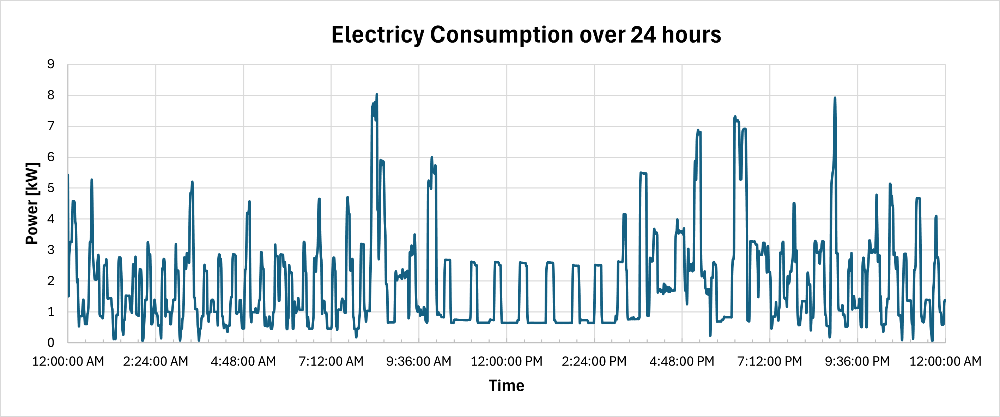
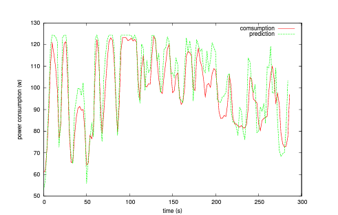
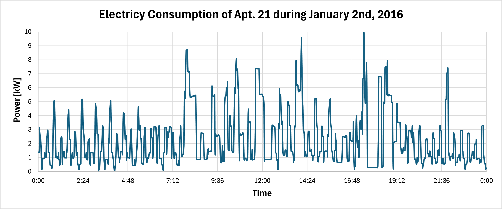
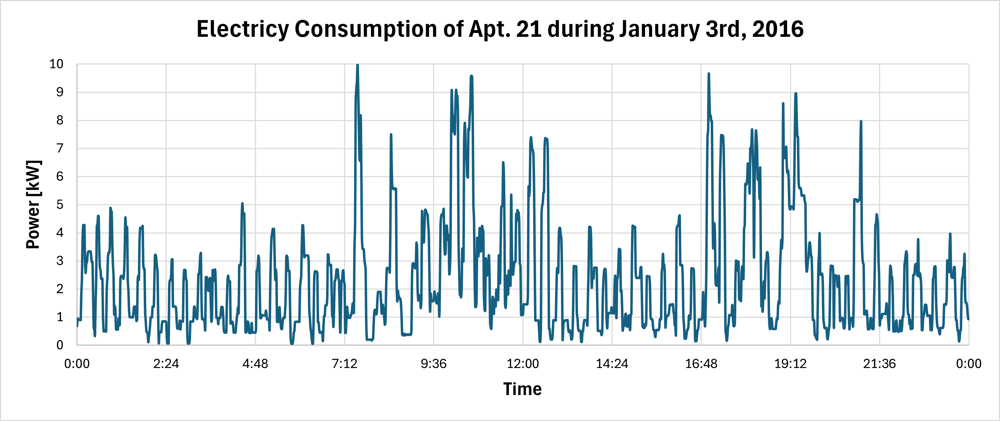

# Report: Analysis of Smart Meters
## Introduction
_An introduction that describes and delineates, as clearly as possible, the case/situation you targeted._

The past few decades have seen a prevalent transition from analog meters to smart meters that has revolutionized the efficiency, sustainability and convenience of electricity management and energy consumption. Traditional analog meters measure the total electricity consumption by tracking the amount of electrical energy passing through them. They are purely mechanical devices, and the readings - which are presented on analog dials or displays - require a manual reading by a technician. By design, those basic meters are not able to provide any real-time monitoring capabilities [[1](https://ieeexplore.ieee.org/stamp/stamp.jsp?tp=&arnumber=5353784)]. Conversely, a smart meter is an electric meter that records granular energy usage data at regular intervals, typically of 30 minutes or less [[2](https://ieeexplore.ieee.org/document/8534430)]. Electronic sensors and microprocessors are utilized to ensure precise measurements of energy consumption, providing more accurate billing to customers. This real-time data is wirelessly transmitted to utility companies, eliminating manual meter readings and the potential for human error in these readings. Many modern systems have adopted two-way wireless communication, allowing energy providers, home devices and displays to interact. Smart meters allow customers to monitor their own utility usage through displays or online interfaces to understand their consumption habits while additionally allowing utility companies to analyze their customer behavior to plan for better services and make strategic decisions for future investments [[1](https://ieeexplore.ieee.org/stamp/stamp.jsp?tp=&arnumber=5353784)]. Canada stands as a prominent example of the widespread adoption of smart meters with 82% of installed meters being smart meters. Several provinces have made substantial investments in research labs that focus on smart grids and their related technologies [[3](https://static4.arrow.com/-/media/arrow/files/pdf/0821/te_trend-paper-smart-metering_0521_en.pdf)]. 

While these devices offer unprecedented insights into energy consumption patterns, their integration into daily lives raises important questions about data security, personal privacy, and the ethical use of consumer information. It is imperative to acknowledge the multifaceted impact of smart meters, specifically regarding the capabilities of parties with access to customer smart meter data to track personal routines, identify household properties, and curate personalized profiles. 

### Worldwide Adoption of Smart Meters
_short history and some info about why they've been adopted_

### A Smart Meter Supplier in the UK: Onzo
- Onzo was formed in the early days of this policy (2015-2020 UK transition to smart meters). "The Smart Meter Implementation Program (SMIP) lays the legal framework in the United Kingdom so that a smart gas and electricity meter, along with an in-home display, can be installed in every household by 2020. Intended to reduce household energy consumption by 5–15%, the SMIP represents the world's largest and most expensive smart meter rollout. The SMIP will involve installing a combined 104 million pieces of new equipment when counting separate electricity and gas meters, in-home display (IHD) monitors and wireless communications networks (Lewis and Kerr, 2014). The combined total cost is expected to be at least £11 billion, or more than £200 per household (Rose and Thed, 2014)." [[3](https://static4.arrow.com/-/media/arrow/files/pdf/0821/te_trend-paper-smart-metering_0521_en.pdf)].

## Research Method
_A research method section that describes, precisely enough to be replicated, the procedures you have followed to collect your data._

We began our research with searches using phrases like "smart meter privacy concerns", "privacy of energy consumption data", and "smart grid technology." These searches brought up a range of materials, including articles, industry reports, and studies from academic journals and news outlets. We went through these documents to get a broad understanding of smart meter technology, its uses, and its effects.

We also explored the references cited in some of the articles we read. This led us to additional relevant articles, enhancing our research with more information on the topic.

Regarding the data for our experiment, which we present in the Results section, we found a publicly available dataset of smart meter readings from 114 apartments over a period from 2014 to 2016. This dataset was available at the UMassTraceRepository, specifically under the "Smart" section of their website [[17](https://traces.cs.umass.edu/index.php/Smart/Smart)]. The specific dataset we used is named "apartment-electrical.tar.gz," found in the "UMass Smart* Dataset - 2017 release" section. 

We downloaded this dataset and focused on the readings from apartment 21 in the year 2016, and we used the data from January 1st to January 3rd to make the graphs for our analysis. This subset of the data can be found in the Excel sheet `apt21-data-subset.xlsx` under the `additional-documents` folder.

We also researched for Onzo and the Data Protection Act: "Onzo's Privacy Policy", "What is fairness in the GDPR", "London GDPR".

## Results
_A results section, which provides a well-organized overview of the results you collected, with cross-references to the appendix._

### A: Smart Meter Data Transmission 
Smart metering is an essential element of the smart grid network, which makes it possible to adjust energy use in real-time and store energy for electric vehicles. Its main purposes are to improve how energy demand is managed and how consumers respond to changes in energy demand. Demand side management encourages people to use less energy by offering them financial benefits, tips for saving energy, and adjusting prices based on real-time data. Demand response controls how much energy people use, for instance by turning off appliances during peak demand periods. However, it is important to understand that smart meters themselves do not control these appliances; they only provide information about how much energy is being used [[4](https://www.semanticscholar.org/paper/Toward-Unified-Security-and-Privacy-Protection-for-Kalogridis-Sooriyabandara/00ec558a9ef8802cb6d5650662a71a7bd325162f)].

Often called the Advanced Metering Infrastructure (AMI), this system serves as the sensory network for the Smart Grid. It involves installing small, intelligent devices like gas, water, and electricity meters in homes and businesses. These devices automatically record detailed information about energy use, such as the amount and timing of consumption. This data is then sent regularly to the utility companies. The data from meters is collected by a gateway, which then sends it from the local network to a wider network. The network within the home or building managed by the gateway is known as the Home or Building Area Network [[5](https://www.semanticscholar.org/paper/Toward-Unified-Security-and-Privacy-Protection-for-Kalogridis-Sooriyabandara/00ec558a9ef8802cb6d5650662a71a7bd325162f)].

It should thus not be a surprise to learn that smart meters face risks like cyber-attacks, tampering, and data privacy issues, especially due to them being an entrypoint in the larger Smart Grid system. Both manufacturers and utility companies are normally responsible for protecting these meters and the data they send. To secure the meters and data, they may need to use strong communication rules, control who can access the system, and encrypt data whether it is stored or being sent. On the manufacturing side, security measures may include setting up device keys, security certificates, and specific settings to ensure the information is secure and trustworthy [[3](https://static4.arrow.com/-/media/arrow/files/pdf/0821/te_trend-paper-smart-metering_0521_en.pdf)].

### B: Energy Disaggregation and Data Applications 

Smart meters not only gauge the overall energy usage of a household but also serve as a gateway to more nuanced insights, specifically with the case of energy disaggregation where usage and energy consumption at the device level is extracted [[6](https://arxiv.org/abs/2007.00326)]. This is possible because each appliance has a distinctive load signature, representing its power consumption characteristics over time. The two distinct approaches for monitoring energy usage and energy disaggregation are intrusive load monitoring (ILM) and non-intrusive load monitoring (NILM). ILM involves directly connecting power meters to each appliance in the household, providing accurate results although with high costs and complex installation, thus referred to as intrusive [[7](https://www.sciencedirect.com/science/article/pii/S2405896315030566)]. In NILM, analysis of the changes in voltage and current of the aggregate load are used to deduce the state of operation of individual appliances. The aggregated signal can be split into device signals using source separation methods or machine learning-based models to detect the existence of devices. 

Energy disaggregation lacks a universally accepted approach, leading to the existence of numerous mechanisms. Methods without source separation directly analyze the aggregated consumption signal and rely on techniques such as pattern recognition, event detection or machine learning to identify appliances. For instance, variants of the Hidden Markov Model (HMM) have been adopted to model the state transition patterns of appliances and to recognize the logical switch on and off of different appliances [[7](https://www.sciencedirect.com/science/article/pii/S2405896315030566)]. Elastic matching approaches perform recognition using template matching and involve comparing the aggregated energy consumption signal with pre-recorded patterns of individual appliances [[8](https://www.mdpi.com/1099-4300/22/1/71#:~:text=The%20experimental%20results%20showed%20that%20elastic%20matching%20algorithms%20can%20successfully,accuracy%20(87.58%25)%20and%20in)]. Recent research in deep learning has led to a surge in data-driven approaches using large datasets. Approaches with source separation extract the consumption of each device from the aggregated signal. Once separated, further analysis or machine learning may be applied to label each component with its corresponding appliance. For example, non-negative matrix factorization expresses the signal as a linear combination of basis vectors in a matrix factorization framework [[8](https://www.mdpi.com/1099-4300/22/1/71#:~:text=The%20experimental%20results%20showed%20that%20elastic%20matching%20algorithms%20can%20successfully,accuracy%20(87.58%25)%20and%20in )]. It is worth noting that disaggregation techniques are not always perfectly accurate. Factors such as the condition and efficiency of appliances as well as appliances with similar power usage and electrical features can affect the reliability of appliance detection. 

With the possible isolation of individual appliances in homeowner consumption data, consumers can be informed about the distribution of energy consumption across their appliances and identify opportunities for energy efficiency improvements. This data also enables monitoring of appliance performance and detecting any abnormalities or inefficiencies through deviations from expected energy consumption levels. Additionally, with analytics techniques and the algorithms mentioned above, households can anticipate future energy usage trends based on historical data and external factors like weather forecasts or occupancy patterns [[9](https://www.nature.com/articles/s41597-022-01252-2)]. 

### C: Beyond Energy Monitoring
A study by Beckel et al. finds that the fine-grained energy consumption data collected by smart meters can lead to identifying specific characteristics that may reveal information about a home’s socio-economic status, dwelling properties and appliances with an accuracy of more than 70% for all households. These characteristics include but are not limited to occupancy, employment status, the number of residents, and the number of appliances. Beckel concludes by stating utilities might need to collect as little as one week of smart meter data, where the interval of smart meter data collection is 30 minutes, to be able to extract household characteristics [[10](https://www.sciencedirect.com/science/article/pii/S0360544214011748)]. Chen et. al similarly indicates the potential for non-intrusive occupancy monitoring by using electricity data from smart meters to infer occupancy. A household’s pattern of electricity usage generally changes when occupants are present due to their interactions with electrical appliances and therefore, energy consumption levels [[11](https://lass.cs.umass.edu/papers/pdf/buildsys13-niom.pdf)]. 

One such example is demonstrated in Souri et al's paper [[5](https://www.sciencedirect.com/science/article/pii/S1877050914007376?ref=pdf_download&fr=RR-2&rr=8567b14b18df4bb9)], where they extracted smart meter data from a house during 24 hours and annotated their deductions.

 

  

_**Figure 1.** Daily energy consumption patterns in a house, from 'Smart Metering Privacy-Preserving Techniques in a Nutshell' by Hajer Souri et al._

The graph in Figure 1 shows the electricity usage in a house during 24 hours. The data reveals distinct patterns: at night, very little energy is used as can be seen by the low amount of power used, while energy consumption spikes at specific times during the day. During the morning, there is a noticeable rise in consumption as the household starts their day. Likewise, energy usage goes up in the evening, corresponding to common domestic tasks like cooking and laundry. The graph also shows the water heater turning on at different times and the refrigerator using a small, steady amount of power all day.

We wanted to verify whether we could replicate the findings reported in this research paper by analyzing a public dataset of meter readings. Our aim was to recreate graphs similar to those featured in this study. To accomplish this, we used meter readings from the UMassTraceRepository. The methodology for creating the graph presented below is detailed in the Research Method section. For the purpose of clarity, we are including only one graph in this discussion, the others can be found in the appendix.

  

_**Figure 2.** Electricity Consumption of Apartment 21 during January 1st, 2016_

The graph shown in Figure 2 displays patterns that are similar to those observed in Figure 1. Specifically, there are noticeable spikes in energy consumption at certain times, while at other intervals, the usage levels off and remains fairly steady. From these observations, we can infer several things. For example, the consistent low energy consumption between 10 AM and 2 PM could imply that the apartment was empty during these hours, or it might indicate that the residents were sleeping. The surges in energy use at 8 AM and again from 7 to 9 PM are likely related to meal preparation and consumption times. Additionally, by examining Figures 4 and 5, which are included in the Appendix, we can make similar inferences about the living habits of the occupants based on the observed energy consumption peaks and periods of steady usage.

In a 2020 study, Schirmer, Mporas and Sheikh-Akbari demonstrate how smart meter aggregated energy consumption data and real-time appliance recognition algorithms can lead to the identification of multimedia content played by a TV or monitor device. With ILM, elastic matching algorithms were able to identify videos with 100% accuracy. In NILM, identification using the same algorithms still achieved high accuracy with 93.8%, even in “noisy” conditions, meaning evaluation with additional power consumption from other devices [[6](https://arxiv.org/abs/2007.00326)]. Researchers at Muenster University of Applied Sciences in Germany came to the same conclusions with their test results indicating that a five minute chunk of consecutive viewing without major interference by other appliances is sufficient to identify the content. This is possible because of unique lighting patterns - the amount of light and dark emitted on the display for individual frames - for individual TV shows and movies which is reflected in energy consumption data. The figure below shows the actual power consumption from the first five minutes of Star Trek (2009) on a Liquid Crystal Display television set measured using a smart meter. 

  

_**Figure 3.** Power Consumption Signature of Star Trek (2009) on an LCD TV Over Five Minutes, Measured by a Smart Meter_

The figure also shows the output of their power consumption prediction function and demonstrates high correlation [[13](https://epic.org/wp-content/uploads/privacy/smartgrid/smart_meter.pdf)]. It is noted that identifying TV content requires a “man in the middle” attack where the light pattern of specific content would have to already be known to compare that with the samples being received from the smart meter. 

As a paper published in 2018 by Cleemput et al. demonstrated, it is possible that an attacker can completely remove the anonymity from users’ detailed metering data by employing a straightforward matching algorithm. The researchers examined whether a supplier could extract additional insights from collected electricity usage data. A supplier would normally have in their possession the smart meter IDs of the customers along with the detailed records of electricity consumed every half hour, which lacks personal identifiers. From the latter, it is trivial to calculate the aggregated monthly data that sums up total consumption per customer. The de-pseudonymization method involves analyzing customers' unique monthly aggregate consumption data, starting with the earliest month available. If a customer's monthly aggregate is unique, their detailed half-hourly data for that month directly identifies them. This process is repeated monthly, focusing on users not yet de-pseudonymized, progressively identifying individuals based on their consumption patterns [[2](https://ieeexplore.ieee.org/document/8534430)].

### D: Onzo and Hydro-Quebec

Onzo's privacy policy states that they collect user information throughout their website intentionally and automatically. They use tools such as web beacons and clear gifs which allow them to collect information intentionally. They also use trackers which allows them to collect data automatically. Onzo collects non-personal and personal information about its customers. In their privacy policy, they don't specify all the data that they are collecting from users. They only give a few examples for non-personal information such as "how you use the Website, including pages visited, page response times, time of use and settings."[[14](https://www.onzo.com/privacy-policy)]. As well as name and email address for personal information. Personal information is very important and they fail to mention other data sets that are potentially being collected such as the user's home address and payment information. 

In their privacy policy, they state reasons for which they send non-personal data to third parties such as "(i) compliance with various reporting obligations; (ii) for business or marketing purposes; or (iii) to assist such parties in understanding our Clients’, Users’ and Visitors’ interests, habits, and usage patterns for certain programs, content, Websites, and/or functionality available through the Website."[[14](https://www.onzo.com/privacy-policy)]. However, they do not mention why they send personal information (with the consent of users) to third parties. They do not directly say the purpose for which it is being collected. The only information given is on their website they state, “ONZO identifies key attributes about the energy retailer’s customers. Based on the insight derived from each individual household's energy consumption patterns, we are able to create relevant personalisation and effectively target customers with products and services that are relevant for that household” [[17](https://www.onzo.com/)]. 

### E: Data Protection Act
Onzo is located in London, therefore they must comply with the Data Protection Act rather than the GDPR [[15](https://www.gov.uk/data-protection)]. When comparing the Data Protection Act and Onzo's privacy policy, certain issues arise. Regarding purpose limitation, ONZO specifies the type of data, whether it be personal or non-personal, that they collect in specific scenarios, such as for cookies and analytics. They describe purposes for which automatically collected, aggregated, or non-personal information is sent to third parties [[14](https://www.onzo.com/privacy-policy)]. However, they do not specify for what purpose personal data is collected. This does not align with the purpose limitation, stating they must process data for a legitimate purpose specified explicitly to the data subject.

With respect to transparency, ONZO discloses how they collect data in their privacy policy but fails to mention other crucial details. They do not state why personal information is sent to third parties and what these parties use this information for. There is no information on how long these third parties store our data and how users can delete their data from these third parties. And most importantly, who these third parties are. They are not being transparent to the data subject.

Concerning fairness, ONZO sends and collects data automatically using tools that do not ask for the user's consent, such as web beacons and clear gifs. Among the data being collected, there is personal information such as the website a user visited before and after accessing Onzo's website [[14](https://www.onzo.com/privacy-policy)]. Users do not expect this information to be collected without consent as it is personal. This is why this does not comply with fairness, which means to collect data in ways only users would expect [[16](https://ico.org.uk/for-organisations/uk-gdpr-guidance-and-resources/data-protection-principles/a-guide-to-the-data-protection-principles/the-principles/lawfulness-fairness-and-transparency/#fairness)].
They can also access the IP address of a user. If they associate this information with the user's IP address, then this is a much more severe infringement on privacy.

## Conclusions
_A conclusions section, which highlight the insights you can derive from the data you collected, with clear links to the evidence._

From this research, we can conclude that there are numerous privacy concerns with smart meter consumption data. The design of smart meters as they are offered presently makes it very easy to abuse customer data. Since the data is transmitted wirelessly, there is a risk of interception or unauthorized access if proper encryption and security protocols are not in place. Additionally, the two-way communication capability, while advantageous for remote management and real-time data access, also increases the potential vectors for cyber attacks. Additionally, the meters’ ability to communicate with other home devices and the provider’s network means that multiple points in the system could be exploited to access consumer data. The web-based interfaces and advanced display units that allow for users to track their energy consumption history are potential targets for hackers. If these systems are compromised, detailed user data could be accessed. 

The intricacies of energy disaggregation not only enable the identification of individual appliances, but also timestamp their usage, thus allowing for the potential monitoring of customers’ behavior and the tracking of their personal routines. Studies, such as those from Beckel and Chen, underscore the alarming reality that smart meters can divulge deeply personal information, spanning from occupancy status to even social class distinctions. These possibilities clearly demonstrate that smart meters have the potential to be utilized as surveillance devices. Identification is another threat, as demonstrated by Cleemput et al. with the possibility of identifying users through their unique patterns of electricity usage. Although it is true that the data does not contain names, the distinctiveness of a user's electricity consumption pattern could allow for identification. This is especially true if additional information, such as a list of customers, becomes available to an external party, enabling them to link anonymous data to specific individuals, hence underlining the importance of protecting this sensitive information.

Furthermore, without strict data protection policies and transparency from utility companies like Onzo, there is a concern that this data is being used to build generous personalized profiles of households or could be shared with third parties without explicit consent from consumers. It is important to note that homeowner data becomes more vulnerable as it is shared or traded. From Onzo's Privacy Policy, we can conclude that there is a lack of information provided, namely who are the third parties that have access to user data and what are their privacy policies. Due to the lack of information, this gives Onzo the liberty to use data in ways that may be malicious. However, by not being transparent towards their users, Onzo can face heavy charges imposed by the Data Protection Act.

Enhanced security measures and strict privacy protocols are therefore essential to prevent unauthorized access and ensure that individuals' consumption data remains confidential. These findings underscore the need for robust data protection strategies within smart metering systems to safeguard against potential privacy breaches. 

## Appendix
_An appendix, which contains larger data sets too cumbersome to put in the results section._

As mentioned in the Results, specifically section C, we generated two additional graphs based on data from January 2nd, 2016, and January 3rd, 2016, pertaining to the same apartment (Apt21). Additionally, we are sharing the Excel sheet that holds the data used for these graphs, which is a subset of the entire data available as described in Research Methods. This Excel sheet can be found under `additional-documents` under the name `apt21-data-subset.xlsx`.

  

_**Figure 4.** Electricity Consumption of Apartment 21 during January 2nd, 2016_

  

_**Figure 5.** Electricity Consumption of Apartment 21 during January 3rd, 2016_

## References
1. K. Allan, "Power to the people [power energy saving]," in Engineering & Technology, vol. 4, no. 18, pp. 46-49, October-November 2009, https://ieeexplore.ieee.org/document/5353784
2. S. Cleemput, et al. “De-Pseudonymization of Smart Metering Data: Analysis and Countermeasures.” IEEE Xplore, 2018, ieeexplore.ieee.org/document/8534430/. 
3. “Smart Meters: Designing a Key Part of the Smart Grid Ecosystem.” Arrow.Com, TE Connectivity, 13 Oct. 2022, https://static4.arrow.com/-/media/arrow/files/pdf/0821/te_trend-paper-smart-metering_0521_en.pdf
4. Kalogridis, G. Toward Unified Security and Privacy Protection for Smart Meter Networks. 2014, www.semanticscholar.org/paper/Toward-Unified-Security-and-Privacy-Protection-for-Kalogridis-Sooriyabandara/00ec558a9ef8802cb6d5650662a71a7bd325162f.
5. Souri, Hajer, et al. “Smart Metering Privacy-preserving Techniques in a Nutshell.” Procedia Computer Science, vol. 32, Jan. 2014, pp. 1087–94. https://doi.org/10.1016/j.procs.2014.05.537.
6. Schirmer, Pascal A., et al. “Identification of TV Channel Watching from Smart Meter Data Using Energy Disaggregation.” arXiv.Org, 1 July 2020, arxiv.org/abs/2007.00326. 
7. Aladesanmi , E.J., and K.A. Folly. “Overview of Non-Intrusive Load Monitoring and Identification Techniques.” Science Direct, Elsevier, 31 Dec. 2015, www.sciencedirect.com/science/article/pii/S2405896315030566. 
8. Schirmer, Pascal A., et al. “Energy Disaggregation Using Elastic Matching Algorithms.” Entropy, vol. 22, no. 1, Jan. 2020, p. 71. https://doi.org/10.3390/e22010071.
9. Pereira, Lucas, et al. “A Residential Labeled Dataset for Smart Meter Data Analytics.” Nature News, Nature Publishing Group, 31 Mar. 2022, www.nature.com/articles/s41597-022-01252-2. 
10. Beckel, Christian, et al. “Revealing Household Characteristics From Smart Meter Data.” Energy, vol. 78, Dec. 2014, pp. 397–410. https://www.sciencedirect.com/science/article/pii/S0360544214011748 
11. Dong, Chen, et al. “Non-Intrusive Occupancy Monitoring Using Smart Meters.” Conference SENSYS, Nov. 2013, https://doi.org/10.1145/2528282.2528294.
12. Weibel, Thomas. Smart - UMass Trace Repository. traces.cs.umass.edu/index.php/Smart/Smart.
13. Greveler, Ulrich et al. “Multimedia Content Identification Through Smart Meter Power Usage Profiles.” Semantic Scholar, 2012, www.researchgate.net/publication/266461208_Multimedia_Content_Identification_Through_Smart_Meter_Power_Usage_Profiles. 
14. “Privacy Policy.” ONZO, www.onzo.com/privacy-policy. Accessed 16 Feb. 2024. 
15. Government Digital Service. “Data Protection.” GOV.UK, 16 Sept. 2015, www.gov.uk/data-protection.
16. ICO. “Principle (a): Lawfulness, Fairness and Transparency.” ICO, ico.org.uk/for-organisations/uk-gdpr-guidance-and-resources/data-protection-principles/a-guide-to-the-data-protection-principles/the-principles/lawfulness-fairness-and-transparency/#fairness.
17. “ONZO | Energising Consumption Data | Utility Energy Disaggregation and Insights.” ONZO, www.onzo.com.