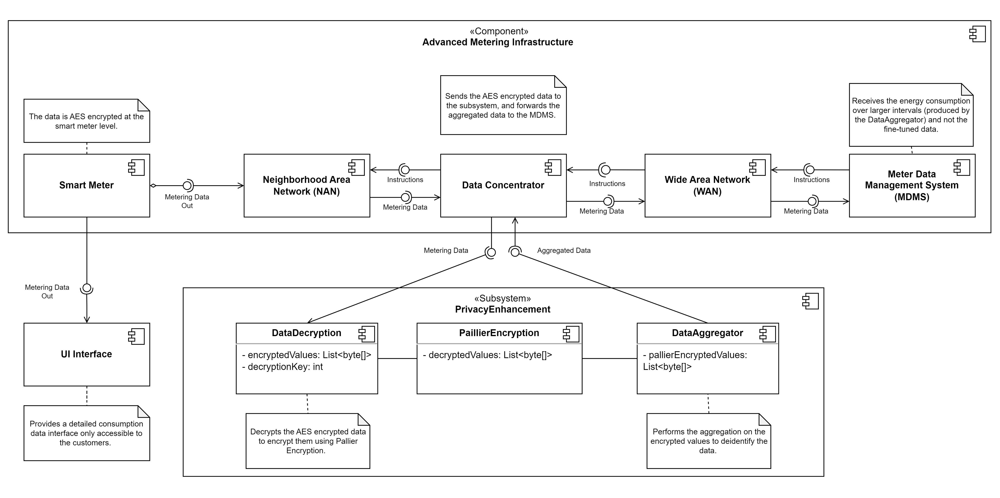

# Architectural Framework for Privacy by Design in Smart Meter Systems
**Group 7:** Ella Reck​, Soumaia Bouhouia​, Felicia Sun​, Vanessa Akhras​.

## 1. System Purpose and Scope

From the aggregated energy consumption data collected by smart meters of individual households, it is possible to infer consumers’ behavior and household properties from the usages of individual appliances, as demonstrated in our case study. Our privacy system, therefore, is focused on averting this tracking and inference of personal routines while still maintaining the original functionality of the smart meter system. Our system takes the form of a data concentrator, serving an intermediary between individual smart meters and the central meter data management system. Data concentrators are typically used in utilities and telecommunications to collect, aggregate and manage data from multiple sources. They facilitate the communication of data between the meters and energy service providers but can also incorporate encryption, authentication and access control mechanisms[^]. 

The core function and privacy requirement of our system is the anonymity of smart meter data and customer confidentiality during billing and during analysis. The way our system achieves this is two-pronged. First, through homomorphic encryption mechanisms, specifically Paillier Encryption (defined in detail in section 6), we ensure that individual consumption data remains private and cannot be accessed or linked to specific individuals without proper authorization. With this cryptosystem, utility companies are able to perform calculations on the encrypted data without decrypting it, allowing for accurate billing solely from the encrypted data. This achieves private access control of detailed data and restricts supplier or third party access to only necessary data. Second, anonymity of smart meter data during analysis will be achieved by aggregating consumption data from individual smart meters into neighborhood level data. The purpose of aggregating data is to provide exactly the function of k-anonymity within a data set: pooling individual data into a larger group to hide individual values and reduce the granularity of the data. The aggregated data still will allow useful analysis, such as demand forecasting and peak usage periods. 

In reference to future milestones, we acknowledge the inability to prototype or demonstrate a physical data concentrator or smart meter; however, we plan on generating a simulation of smart meter readings, smart meter to central data management system communication, and our privacy system with public smart meter data sets. 

## 2. Similar Systems
We looked at four other companies and the security measures they take. We focused primarily on encryption, de-identification, privacy by design, and generalization by aggregation, as we will be implementing them into our system.

The first company is Landis+Gyr, and the Smart Meter we chose from them is the "IoT grid sensing electric meter"[^1]. We found that in terms of security, they implement encryption through a 256-bit AES, digital image signing by validating all signatures on all firmware and application images, and they implement physical hardening by doing post-security and data-at-rest encryption[^2].

The second company is Hydro One. They mention that data collected is processed by the Independent Electricity System Operator (IESO) before being used[^3]. IESO is a company that protects the privacy of Ontarians and does so by de-identifying data and aggregating it[^4]. Their system meets "the internationally recognized principles of Privacy by Design®"[^4].

The third company is EKM Metering Inc. They don't mention that they impement any specific data protection when it comes to data collection done by their meters. The only information they provide is that the data is stored in the cloud[^5].

Finally, the fourth company is ONZO. ONZO does protect data through "secure data transfer, data encryption, multi-factor authentication, and role-based access controls distributed across a scalable, secure infrastructure, provided by Amazon Web Services"[^6]. Even though ONZO might protect users' data, we've seen in our first report that they potentially give this data to third parties and that we don't know who these are.

As for our system and the ways we protect data, refer to section 6 about the architecture.

| Company  | Encryption  | Privacy By Design   |  De-Identification | Generalization by Data Aggregation  |
|---|---|---|---|---|
| Landis+Gyr  |  :white_check_mark: | :x:  | :x:  | :x:  |
| Hydro One  | :x:  | :white_check_mark:  |:white_check_mark:   | :white_check_mark:  |
| EKM Metering Inc | :x:  | :x:  | :x:  |  :x:|
| ONZO | :white_check_mark:  | :x:  | :x:  |  :x:|
| Our system | :white_check_mark:  | :white_check_mark:  | :white_check_mark:  |  :white_check_mark:|

## 3. Functional Requirements
The system must protect consumer privacy by obfuscating personal routines and habits that can be derived from aggregated energy consumption data. The goal is to prevent unauthorized inferences from the energy supplier and possible third parties, while maintaining transparency in energy usage for the consumers.

### 3.1 Data Privacy and Access
1.	**Private Access to Detailed Data:** The system must allow the customer to access detailed energy consumption data via a private key that is unique to each user and not accessible by anyone else.
2.	**Restricted Supplier and Third-Party Access:** The system must ensure that suppliers and possible third parties can only access aggregated and anonymized data, with no capability to view individual and detailed customer energy consumption.

### 3.2 Communication and Data Handling
1.	**Smart Meter to MDMS Communication:** The system must include a secure communication component between the smart meters and the Meter Data Management System (MDMS) that encrypts data transmission.
2.	**Billing Data Averaging:** For billing purposes, the system must send averaged out data about each customer over longer intervals to prevent fine-grained consumption patterns from being revealed.
3.	**Supplier-Side Aggregation:** To inform the supplier about energy demands, the system must aggregate more detailed data among members of a neighborhood, ensuring individual user data remains private.

### 3.3 Data Encryption
1.	**End-to-End Encryption:** The system must encrypt data from the point of capture at the smart meter to the other components, ensuring data integrity and confidentiality.
2.	**Encryption Standards Compliance:** The system must employ strong encryption standards compliant with industry best practices for data in transit and at rest.

### 3.4 System Reliability and Performance
1.	**Real-Time Processing:** The system must be capable of processing real-time data for immediate access by the customer using their private key.
2.	**High Availability:** The system must ensure high availability for the continuous and reliable operation of smart meters and accessibility of MDMS.

## 4. Privacy Requirements

### 4.1 Data Anonymity and Customer Confidentiality
1. **Anonymization**: Ensure personally identifiable information is stripped from collected data to prevent identification. Aggregate individual consumption data into neighborhood-level or anonymized datasets to prevent identification of specific individuals. 
2. **Encryption**: Data is encrypted in transit and at rest to protect from unauthorized access or interception. 

### 4.2 Data Minimization 
1. Collect only the necessary data required for billing and system operation. Minimize the collection of personal information beyond what is essential for providing services.
2. **Data Retention and Deletion:** Regularly review and delete outdated or unnecessary data.

### 4.3 Transparency and Consent 
1. Inform users about the data being collected and obtain explicit consent to do so. 
2. Maintain transparency about data collection, aggregation, and privacy practices through clear privacy policies, terms of service and data usage agreements 

### 4.4 Regulatory Compliance
1. Stay informed about updates to privacy regulations and adapt the system accordingly to maintain compliance and mitigate privacy risks. 

## 5. Stakeholders
The companies that own the smart meters would be using our system. They would implement our system between the data flow from the smart meters to their databases. This will ensure that data gets generalized before it arrives at the company's databases. These companies should use our system as it protects users' data and therefore attracts more users by demonstrating that third parties or non welcomed parties cannot identify people by their data. Privacy is also an important factor when it comes to smart meter companies, as they collect personal information about users. By using our system, it allows companies to follow privacy regulations better therefore potentially avoiding fines or lawsuits.

Users are also involved in the smart meter process. They provide the data and also use the system to monitor their data. Users have access to the detailed version of their data provided the company shares this information. If users do have access to their data, then when companies use our system this guarantees to the user that their data will be protected.

## 6. Architectural Design Decisions and Models:
*Elicit a high-level decomposition of your system into components, modes of communication, major technology used, etc. Be sure to represent decisions that have an impact on privacy. Create one or more original diagrams representing the key aspects of the system. UML is strongly recommended. Ad hoc boxologies are not recommended. The model should be consistent with the decisions elicited.*

### 6.1 General Overview of the System
In smart meters like the the Relevlo model described in section 3, data is secured in transit using AES encryption, which provides robust protection against interception. However, this encrypted data must eventually be decrypted for processing, either at the Data Concentrator or the MDMS, so that operations such as billing calculations and consumption monitoring can be performed. This necessary decryption step represents a critical point in the data handling process where user privacy could potentially be compromised.

To mitigate this risk and enhance user privacy, we propose an architecture that incorporates an additional layer of encryption using the Paillier cryptosystem. Our strategy involves decrypting the AES-encrypted data when it reaches the Data Concentrator and immediately re-encrypting it with Paillier encryption. This approach is designed to maintain the confidentiality of individual user data while still allowing the necessary aggregated computations for billing and monitoring.

Paillier encryption is a type of public-key cryptography notable for its homomorphic property, which allows computations to be performed on encrypted data (ciphertexts) without decrypting it. Specifically, it’s additively homomorphic, meaning that arithmetic operations like addition performed on encrypted values will, when decrypted, yield the same result as if the operations had been performed on the original data. Its security relies on the difficulty of integer factorization, a foundation shared with RSA encryption. Despite its benefits for privacy protection, Paillier encryption is computationally more demanding. For this reason, we will be using TODO: **[talk about the optimized Paillier Encryption]**. 

In your smart metering system, Paillier encryption enables the utility company to perform necessary operations on encrypted meter readings without compromising individual users' privacy. This means that detailed user data remains confidential throughout the process, while still allowing the utility to perform essential functions like billing and monitoring energy consumption trends.

Furthermore, considering that smart meters send data incrementally, the decryption and re-encryption process at the Data Concentrator involve only small batches of data at a time. This limits the window of vulnerability where user data could be exposed in plaintext form. By minimizing the amount and duration of data in a decrypted state, we significantly reduce the potential impact of any single point of failure in the system's privacy architecture.

TODO: Mofify diagram to include user interaction with the system

  

- **Smart Meter Encryption:** Each Smart Meter encrypts its data using AES encryption before transmission to ensure the security of data in transit.
- **Data Flow to Data Concentrator:** The AES-encrypted data from the Smart Meters is transmitted through the Neighborhood Area Network to the Data Concentrator.
- **Data Decryption and Re-encryption at Data Concentrator:** Upon receipt, the Data Concentrator decrypts the AES-encrypted data. It then immediately re-encrypts the data using the Paillier encryption system. This step is crucial to transition from the secure transmission encryption to the encryption method that allows for aggregated computations.
- **Data Aggregation:** The Data Concentrator aggregates the now Paillier-encrypted data over defined time intervals or by neighborhood, depending on the desired granularity. This aggregation process is designed to work directly on encrypted data, leveraging the homomorphic properties of Paillier encryption.
- **Secure Transmission to MDMS:** The aggregated, Paillier-encrypted data is transmitted over the Wide Area Network (WAN) to the Meter Data Management System (MDMS). The WAN ensures the secure transmission of this encrypted data using advanced security protocols.
- **Storage in MDMS:** The MDMS stores the aggregated, Paillier-encrypted data. It can perform certain computations on this data without the need for decryption, preserving the privacy of individual user data.

### 6.2 Selection of Homomorphic Encryption for Data Privacy and Analysis
We want to anonymize user data while enabling the suppliers to perform the operations they need on the data, i.e., calculating the billing fees as well as being able to monitor the general energy consumption of particular neighborhoods.  For this purpose, we propose the use of Paillier Encryption.

For the purpose of this report, detailed implementation specifics and technical terms regarding Paillier encryption will not be extensively discussed beyond what is necessary for understanding the system’s operation and security mechanisms. 

Paillier encryption is a type of public key cryptography, named after its inventor Pascal Paillier who proposed the system in 1999. The security of this cryptosystem is based on the presumed computational difficulty of certain mathematical problems, specifically the difficulty of factoring large composite numbers into their prime factors and distinguishing between numbers that are quadratic residues modulo a composite number (also known as the Decisional Composite Residuosity Assumption). 

This scheme is a type of homomorphic encryption scheme, meaning mathematical operations are able to be performed on encrypted data without decrypting it first. The Pallier scheme supports the addition operation and is categorized as a semi-homomorphic encryption scheme (since multiplication cannot be performed on ciphertexts in this cryptosystem).  

#### Context and Considerations for Using Paillier Encryption:
- **Privacy:** Paillier encryption preserves the confidentiality of individual users' data while allowing the aggregation needed for billing and supply forecasting. 
- **Regulatory Compliance:** Using encryption to protect user data can help in meeting data protection regulations.
- **Performance:** While homomorphic encryption is generally slower than traditional encryption methods, Paillier is relatively efficient for addition operations, which is the primary operation needed for aggregating energy usage data.

#### Alternatives Considered and Rejected:
- **Symmetric Encryption:** Rejected due to the single point of failure in key management and lack of support for operations on encrypted data. 
- **Asymmetric Encryption:** While it provides secure data transmission, it does not support homomorphic properties for processing aggregated data.
- **Non-encrypted Aggregation:** Not considered due to non-compliance with privacy requirements.

#### Rationale for Choosing Paillier Encryption:
- It enables additive homomorphic properties, meaning that the system can compute the sum of encrypted user data without decrypting it, which is suitable for generating aggregated statistics.
- It does not require the sharing of decryption keys with the data processor (supplier), which reduces the risk of exposing individual user data.

## 7. Important Scenarios:
*Identify and describe important scenarios. A scenario is "a well-defined description of an interaction between an external entity and the system. It defines the event that triggers the scenario, the interaction initiated by the external entity, and the response required of the system" [Rozanski and Woods]. You can represent scenarios using plain text or UML Sequence Diagrams. The scenarios you choose should be relevant to the privacy requirements and be generally useful for developing and communicating your system architecture.*

## References
[^1]:https://www.landisgyr.com/product/revelo-metering-platform/
[^2]:https://www.landisgyr.com/webfoo/wp-content/uploads/2020/01/2023-11-Revelo-Product-Page-Singles-ForDigital.pdf
[^3]:https://www.hydroone.com/rates-and-billing/meters/smart-meters
[^4]:https://www.ieso.ca/en/Sector-Participants/Smart-Metering-Entity/Data-Sharing
[^5]:https://www.ekmmetering.com/en-ca/pages/meter-data
[^6]: https://www.onzo.com/trust-guide
[^7]: https://www.ti.com/lit/wp/spry248a/spry248a.pdf?ts=1709191363299&ref_url=https%253A%252F%252Fwww.google.com%252F#:~:text=A%20data%20concentrator%20is%20the,to%20the%20central%20utility%20database.
