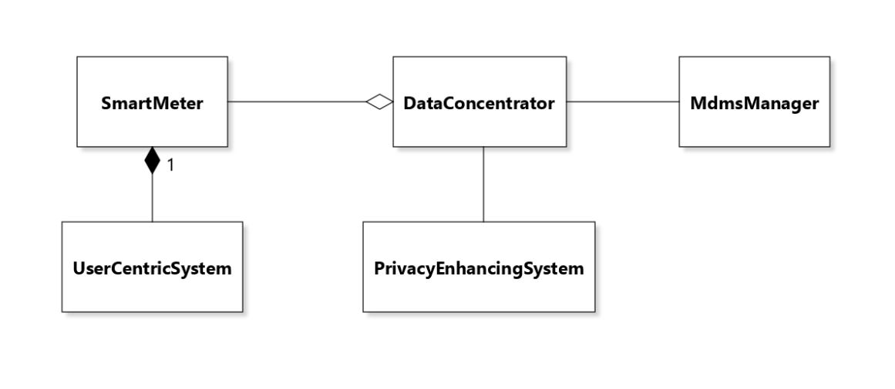
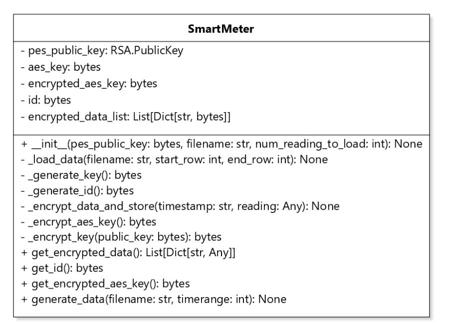
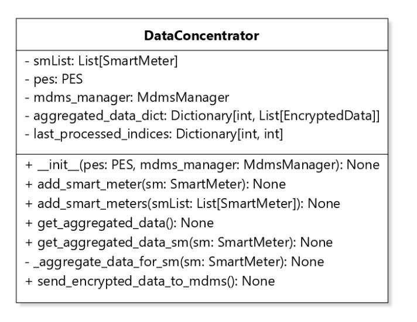
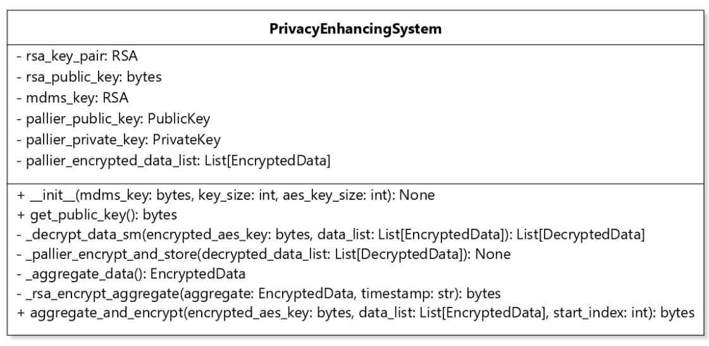
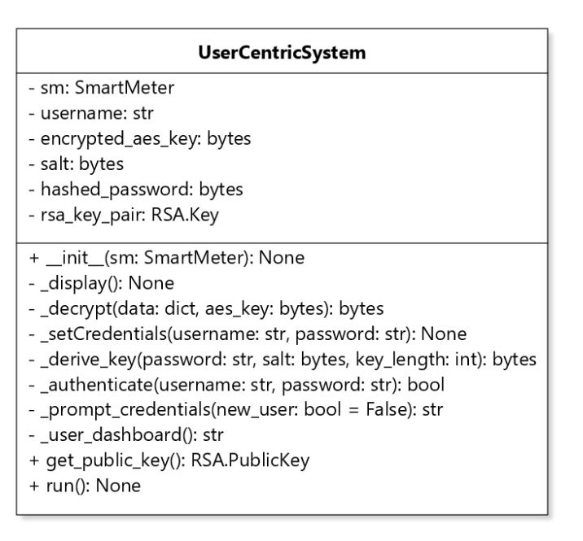

# Report on the Implementation of the Smarter Metering System

Group 7: Ella Reck​, Soumaia Bouhouia​, Felicia Sun​, Vanessa Akhras​.

## 1. Smarter Metering and Privacy-First Energy Management 

Our research has indicated that from the aggregated energy consumption data collected by smart meters of individual households, it is possible to infer consumers’ behavior and household properties. In order to avert this tracking and inference of personal routines while still maintaining the original functionality of the smart meter system, we introduce the Smarter Metering system. 

The Smarter Metering system includes two main components:

1.	**Privacy Enhancement System (PES):** At the heart of our system, the PES functions as the principal unit for encrypting and processing energy consumption data. Smart meters encrypt household energy data using the Advanced Encryption Standard (AES) before sending it to the PES via the Data Concentrator. At the PES, the AES-encrypted data is decrypted and immediately re-encrypted using the Paillier cryptosystem, adding an advanced layer of security. A key aspect of this process is that only a minimal amount of data is decrypted at any one time, reducing risk. Importantly, this granular data is not stored after processing, further ensuring consumer privacy. Additionally, the PES aggregates data to remove granularity before sending it to the Meter Data Management System (MDMS), where the aggregated data is encrypted using RSA. This aggregation step ensures that the MDMS receives data in a form that prevents the derivation of individual household behaviors while still enabling the performance of necessary statistical analyses and bill calculations directly on encrypted data, thereby maintaining stringent consumer privacy standards.

2.	**Secure Data Transmission to User Centric System (UCS):** Parallel to our privacy goals, the system ensures the secure transmission of encrypted energy data from smart meters to a User-Centric System (UCS). This element allows consumers to securely access detailed information about their energy consumption. The architecture guarantees that only the users associated with the specific smart meters can decrypt and view their granular data. This approach aligns with our objective to offer consumers privacy without hindering their ability to understand their energy usage. 

By integrating the Smarter Metering system's PES and secure data transmission protocols, we address crucial concerns about data confidentiality in the era of smart utilities, ensuring that smart meters can continue to provide valuable energy insights without compromising consumer privacy.

## 2. Requirements

The main goal is to balance consumer privacy with energy suppliers' need for energy consumption data for billing and analysis purposes while still allowing customers to view their own data. Our functional and privacy requirements, detailed in M3, were met through the following design decisions:

### 2.1 Data Privacy, Access, and Minimization: 
1. **Private Access to Detailed Data:** Our system allows the customer's detailed energy consumption data to be only accessible by the customer. This is achieved by having the [User Centric System (UCS)](#35-user-centric-system), which acquires the AES-encrypted data directly from the customer's smart meter. Then, the customer can retrieve the detailed data after authenticating themselves using a username and password. An RSA key pair is used to distribute the smart meter's symmetric AES key to the User Centric System.
2. **Restricted Supplier and Third-Party Access:** Our system ensures that suppliers and possible third parties do not have the capability to view individual and detailed customer energy consumption. This is done by storing two types of data in the [Meter Data Management System (MDMS)](#34-mdms). We either have an individual's data, which has been aggregated over a longer period of time, or a neighbourhood's data, where the data from all customers in the neighbourhood is aggregated to show energy consumption in shorter intervals of time.
3. **Data Minimization:** To avoid collection of personal information beyond what is essential for providing services, only the necessary data required for billing and system operation is sent to the MDMS. 

### 2.2. Data Encryption, Data Anonymity, and Customer Confidentiality
1. **Anonymization and End-to-End Encryption:** The most pressing function and privacy requirement of the Smarter Metering system is the anonymity of smart meter data and customer confidentiality during billing and analysis. Our system achieves this through multiple steps of encryption. Specifically, the data is immediately encrypted with AES at collection by the [Smart Meter](#31-smart-meter-simulation) and then decrypted and re-encrypted immediately with the Paillier encryption scheme in the [Privacy Enhancing System (PES)](#33-privacy-enhancing-system). The Paillier cryptosystem is known for its homomorphic properties that allow computations to be performed on encrypted data without decrypting it. This enables the utility company to perform necessary operations like billing and monitoring energy consumption trends on encrypted meter readings without compromising individual users’ privacy. This scheme renders it unnecessary for raw individual data to be handled at any time. 

### 2.3 Communication and Data Handling
1.	**Smart Meter to MDMS Communication:** Our system include a secure communication component between the smart meters and the [Meter Data Management System (MDMS)](#34-mdms) that encrypts data transmission.
2.	**Billing Data Averaging:** For billing purposes, the [Privacy Enhancing System (PES)](#33-privacy-enhancing-system) component of our system sends averaged out data about each customer over longer intervals to prevent fine-grained consumption patterns from being revealed. The data is sent to the MDMS.
3.	**Supplier-Side Aggregation:** To inform the supplier about energy demands, the PES aggregates more detailed data among members of a neighborhood, ensuring individual user data remains private.

### 2.4 System Reliability and Performance
1.	**Real-Time Processing:** Our system is capable of processing real-time data for immediate access by the customer using their private key. There is minimal overhead in the UCS.
2.	**Data Integrity and Accuracy:** The chosen additional encryption and aggregation steps in our system do not affect the integrity and accuracy of data, which is important to ensure that billing calculations or reporting and analysis based on the encrypted and aggregated data are correct and reliable. 

## 3. Implementation of the System 

The aim of this project is to enhance privacy for user data by aggregating it, allowing individuals to view their own detailed consumption while also enabling energy suppliers to conduct analyses and calculate billing. The system simulation demonstrates the potential integration of a Privacy Enhancing System (PES) without significantly altering the existing operations of smart meters, data concentrators, and the Meter Data Management System (MDMS). Additionally, a user-centric system has been developed to enable users to access their detailed consumption data. We chose the implement the system using Python due to the availability of the Paillier Encryption module, `phe`. 

  

_**Figure 1.** UML Class Diagram of the system. Only the class names were kept in the diagram for conciseness and to emphasize on the relationships between the classes._

In the process flow described:

1. A PES instance is created to generate a public key for the smart meters' use, along with instances of the MDMS manager and a DataConcentrator. The PES public key is crucial for encrypting the AES key of the smart meters, ensuring PES can decrypt the data securely, as indicated by the dependency relationship in the diagram above.
2. Multiple Smart Meter instances are then created, simulating meter readings from a 2016 dataset provided by the University of Massachusetts Amherst. Each row in the dataset files represents a one-minute reading interval.
3. These Smart Meter instances are added to the DataConcentrator, which compiles the data and sends a request to the PES to aggregate all readings received up to that point.
4. The aggregated data is transmitted to the MDMS via the MDMS manager.
5. The UserCentricSystem is dependent on a Smart Meter instance to operate, indicated by a composition link. Upon initializing a UserCentricSystem object with a Smart Meter, a user account may be set up at the first system start-up. Once the user logs in successfully, they can access their detailed consumption data exclusively.

In the next subsections, we will be diving deeper into each component of the system, the choices made during implementation, and examine how these decisions align with the objectives established in this report and its predecessor.

### 3.1 Smart Meter Simulation 
The smart meter class, available in smart_meter.py, encapsulates the functionality of a smart meter, which collects energy consumption data and transmits it to the PES. 

#### 3.1.1 Source Code Overview
Upon initialization, the smart meter instance requires the PES public key, a filename containing energy consumption data and an optional parameter specifying the number of readings to load initially. During initialization, the system generates a random AES key for data encryption, encrypts it using PKCS-OAEP (Public-Key Cryptography Standards - Optional Asymmetric Encryption Padding) encryption with the PES public key, and generates a unique identifier for the smart meter. PKCS-OAEP is designed to enhance the security of RSA encryption by adding randomness to the plaintext before encryption. 

Importantly, the generation of consumption data is simulated with the load_data function on line 16. The openpyxl library for reading and writing Excel files was utilized in order to load an existing Excel workbook from a file so that it can be manipulated within our script. 

  

_**Figure 2:** SmartMeter Class UML Diagram._

The UML diagram for the SmartMeter class provides a representation of its internal composition, detailing both the data it stores and the functionalities it offers.

**Attributes:**

- `pes_public_key`: An instance of RSA.PublicKey used to encrypt the AES key, ensuring that only the PES can decrypt the energy consumption data sent from the smart meter.
- `aes_key`: A 256-bit key used by the smart meter for AES encryption of its data readings.
- `encrypted_aes_key`: This is the AES key after it has been encrypted with the PES public key, ready to be securely transmitted to the PES.
- `id`: A unique byte sequence that serves as the identifier for the smart meter, distinguishing it from others in the network.
- `encrypted_data_list`: A collection that holds dictionaries mapping timestamps to encrypted data readings, encapsulating each data point securely.

**Public Methods:**

- `get_encrypted_data():` Retrieves the list of encrypted data points, which includes the encrypted readings alongside their associated timestamps. Used by the Data Concentrator to get the readings.
- `get_id():` Returns the unique identifier of the smart meter, allowing for verification and tracking within the system.
- `get_encrypted_aes_key():` Provides the encrypted version of the AES key, which can only be decrypted by the PES with the corresponding private RSA key.
- `generate_data(filename: str, timerange: int)`: Loads additional data readings from a specified file within a certain time range, encrypting and storing them internally.

**Private Methods:**

- `_generate_key()`: Produces a random 256-bit AES key for the encryption of data readings.
- `_generate_id()`: Generates a unique random identifier for the smart meter.
- `_encrypt_data_and_store(timestamp: str, reading: float)`: Encrypts individual readings along with their timestamps and stores them in the encrypted_data_list.
- `_encrypt_aes_key()`: Encrypts the smart meter’s AES key with the PES's public key using RSA encryption.
- `_load_data(filename: str, start_row: int, end_row: int)`: Internal method to load and encrypt data readings from a file, starting and ending at specified rows.

#### 3.1.2 AES Encryption Implementation 
Consistent with current smart meter system implementations, we utilized AES encryption in our simulation in the initial generation and transition of the smart meter data. This was achieved through utilizing a Python package, PyCryptodome, that contains low level cryptographic primitives. Our research demonstrated that this package is widely used for cryptographic operations and is considered secure when used correctly.

For our meter readings, we specifically used Galois/Counter Mode (GCM). This mode offers the added benefit of data integrity alongside encryption, which is particularly important regarding our main goals to ensure data remains confidential and that it has not been tampered with. For our smart meters, we decided to implement 256 bit keys since our priority was increased security. Longer keys typically increase the difficulty of any cryptanalysis or brute force attacks and may provide an additional security margin. 

Ultimately, the success of AES implementation depends on proper key management. The key distribution problem was resolved by encrypting the smart meters symmetric key with the PES’s public RSA key. This guaranteed that the PES was the sole party with access to the key and therefore to the encrypted data.   

### 3.2 Data Concentrator

The Data Concentrator acts as the middleman in our system. Its purpose is to connect the other system components and transfer data between them. Although this component could be removed - the smart meters can be directly connected to the PES, and the PES can be directly connected to the MDMS - it would make the system much more complicated to change, and the various references to the connecting components would be scattered across the system. The structure of the DataConcentrator class is as follows:

  

_**Figure 2:** DataConcentrator Class UML Diagram._

The UML diagram for the DataConcentrator class provides a representation of its internal composition, detailing its process to send requests to the PES to aggregate the collected readings.

**Attributes:**
- `smList`: A list of smart meters, representing the smart meters in the current community. 
- `pes`: An instance of a Privacy enhancing system. 
- `mdms_manager`: An instance of a Mdms manager. 
- `aggregated_data_dict`: Dictionary to store the aggregated data. 
- `last_processed_indices`: List that maps smart meter IDs to the last processed indices to avoid re-aggregating. 

**Public Methods:**
- `__init__(pes: PES, mdms_manager: MdmsManager)`: Initializes the instance of the data concentrator with the inputted instance of a PES and MdmsManager. 
- `add_smart_meter(sm: SmartMeter)`: Adds smart meters to the smList field indicated above. 
- `add_smart_meters(smList: SmartMeter)`: Adds a list of smart meters to the smList field indicated above. 
- `get_aggregated_data()`: For each smart meter in the smList, a request is made to the PES instance to aggregate and encrypt the data. 
- `get_aggregated_data_sm(sm: SmartMeter)`: Makes a request to the PES instance to aggregate and encrypt the data for a single smart meter. 
- `send_encrypted_data_to_mdms()`: Sends the aggregated data dictionary to the mdms. 

### 3.3 Privacy Enhancing System
The Privacy Enhancing System (PES) serves as an integral part of our system, with the specific purpose of securely aggregating individual energy consumption records. This system integrates with the current smart meter setup, significantly improving user privacy without interrupting the steady stream of data required by energy providers for billing and analysis purposes.

Paillier encryption, utilized within the PES, is notable for its additive homomorphic feature. It allows for arithmetic operations, such as summing, on encrypted values without decrypting them, thus maintaining the confidentiality of individual data. Although Paillier encryption introduces some computational overhead due to the complexity of homomorphic operations, the impact on system performance is minimal because the data is aggregated incrementally. Thus, the overhead does not significantly impact the overall system's performance.

Nevertheless, we acknowledge that extensive computations are necessary when transmitting aggregated data to the Meter Data Management System (MDMS). To maintain system efficiency, particularly during these critical operations, we opted to re-encrypt the aggregated data using RSA. RSA provides a balance between robust security and manageable computational demands.  This re-encryption ensures that only the MDMS, which has the corresponding RSA private key, can decrypt and access the aggregated data. 

This choice ensures that the added processing time due to Paillier's homomorphic capabilities does not adversely affect the timely delivery of data to the MDMS. Therefore, the PES can securely process and transmit aggregated data to energy suppliers, enabling them to access the necessary information for billing and analytics without compromising individual user privacy.

#### 3.3.1 Source Code Overview

We provide below a UML diagram representing the internal structure of the PES class.

  

_**Figure 4:** PrivacyEnhancingSystem Class UML Diagram._

As illustrated in the source code and the corresponding UML diagram, the PES is structured to support secure data handling and privacy-preserving operations:

**Attributes:**

- `rsa_key_pair`: An RSA key pair essential for secure data communication. The private key is kept within the PES to decrypt information, while the public key is shared with smart meters to encrypt their data before sending.
- `rsa_public_key`: The public component of the RSA key pair, provided to smart meters to enable encryption.
- `mdms_key`: The public key of the Meter Data Management System (MDMS), used by the PES to encrypt aggregated data ensuring that only the MDMS can decrypt it.
- `paillier_public_key` and `paillier_private_key`: A pair of keys for the homomorphic encryption, allowing the PES to compute on encrypted data without needing to decrypt it, hence maintaining user privacy.
- `paillier_encrypted_data_list`: A secure storage for encrypted energy readings, which the PES uses to collect data over time for batch processing and aggregation.

**Public Methods:**

- `__init__()`: Sets up the PES with the necessary RSA and Paillier keys and establishes a link with the MDMS.
- `get_public_key()`: Shares the RSA public key with smart meters, which they use to encrypt their AES keys.
- `aggregate_and_encrypt()`: The main public method that manages the flow of data from decryption to re-encryption, ensuring data is handled securely throughout the process.

**Private Methods:**
- `_decrypt_data_sm()`: A private method that decrypts data from smart meters with the RSA private key, readying it for processing.
- `_paillier_encrypt_and_store()`: Uses the Paillier public key to re-encrypt decrypted data homomorphically, allowing aggregation while preserving privacy.
- `_aggregate_data()` and `_rsa_encrypt_aggregate()`: Aggregate decrypted data and then re-encrypt it using the MDMS public key so that only the MDMS can view the final results.

#### 3.3.2 Paillier Encryption Implementation
In implementing Paillier encryption for the Privacy Enhancing System, we carefully selected the algorithm and software library to ensure the system was practical, secure, and easy to use. We chose Python as our programming language because it is widely used and supports a variety of cryptographic libraries.

**Modules considered:**
- [`python-paillier`](https://github.com/data61/python-paillier): This Python library is easily installed via pip, Python's package installer. It is user-friendly and supports essential operations needed for homomorphic encryption, such as adding constants to encrypted values, multiplying encrypted values by constants, and adding together encrypted values. Its simplicity and functionality made it an excellent fit for our system requirements.
- [`pailliercryptolib`](https://github.com/intel/pailliercryptolib_python): Optimized for Intel CPUs, this library works well with Ubuntu and Red Hat Enterprise Linux. It could be particularly useful in a controlled environment and might require setting up a specific operating system or using Docker containers to manage dependencies. 

We chose `python-paillier` for its straightforward integration with our Python-based system. Its ease of installation and compatibility with our development environment were key factors in this decision. The library enables our system to carry out necessary encrypted computations efficiently without the need for complex setups or specialized hardware.

This choice influenced the overall system design, reaffirming Python as our preferred language due to its strong support for cryptographic functions and its popularity in data security applications. Functions from the `python-paillier` library are used in our source code to encrypt, add, and multiply values as needed, seamlessly integrating with the rest of our system’s operations.

### 3.4 MDMS
The Meter Data Management System (MDMS) serves as a key interface for companies utilizing our software. It ensures that the data accessible to these companies is aggregated and anonymized, enhancing user privacy. The MDMS comprises two primary components: the MDMS User Interface (UI) and the MDMS database.

#### 3.4.1 MDMS Manager

#### 3.4.2 MDMS UI
The MDMS UI is developed as a Node.js application. Upon launching the app, users are provided with a URL that directs them to a login page. As we were more focused on the privacy involving the data aggregation and granularity, implementing a login which verifies if the user is a valid based off a database was out of our scope. The login page is designed for administrators from the company utilizing our software. Once logged into the MDMS, administrators can view smart meters and their related statistics. Selecting the statistics link navigates to a page that displays power consumption and billing information for the chosen smart meter. 

Anonymity and confidentiality, essential requirements outlined in section 2, are addressed prior to this stage using AES and Paillier encryption. The MDMS manager ensures the privacy of data displayed to administrators by maintaining encrypted IDs, thereby preventing any association of smart meters to specific individuals. Data is retrieved from the MDMS database, which will be detailed in section 3.4.3. Since the data is aggregated and encrypted, it prevents administrators from deducing individual consumer behavior or household routines.

#### 3.4.3 MDMS Database
To simulate smart meter data production, we use data stored in the `c555w24/m5/src/data` directory, whcih consists of CSV and XLSX files for each apartment equipped with a smart meter, recording power consumption at one-minute intervals over a year. This data is first aggregated by the PES, as discussed in the previous sections. Post-aggregation, the data is encrypted using RSA instead of maintaining Paillier encryption. While Paillier encryption is advantageous for its computational capabilities on encrypted data, it introduces significant overhead, particularly when performing multiple calculations within a short timeframe. This becomes impractical for real-time interactions with the MDMS Manager UI, making RSA a more suitable choice for this scenario. The encrypted data is stored in a MongoDB Atlas database managed by the MDMS.

In the `c555w24/m5/src/mdms-ui` folder, the `app.js` file is the core component of the Node.js application managing database interactions. It establishes a connection to the MongoDB database using the "MongoClient" linked provided by MongoDB, followed by a connect function on the resultant object. Within app.js, various functions query the database, such as `app.get('/statistics')`, which is activated by a browser GET request to fetch the statistics page. This function retrieves apartment IDs and updates the statistics page to reflect this data, ensuring administrators have timely access to aggregate consumption statistics.

### 3.5 User Centric System
One of our main requirements was the ability for customers to have secure access to their own energy consumption data. This aspect of our system is achieved through the `user_centric_system.py` class which is accessible within the folder `src` and referred to in the following sections. 

  

_**Figure 2:** UserCentricSystem Class UML Diagram._

The UML diagram for the UserCentricSystem class provides a representation of its internal composition, detailing the process to provide data to users. 

**Attributes:**
- `sm`: An instance of a SmartMeter; this is the smart meter associated with the user account.
- `username`: A string inputted by the user that is used when they log back in to their account.
- `encrypted_aes_key`: This is the smart meter’s AES key after it has been encrypted with the user’s public key.
- `salt`: This is a unique 16 byte string utilized for the password based key derivation function. 
- `hashed_password`: This is the hashed user password that is used for authentication purposes when the user logs in. 
- `rsa_key_pair`: A RSA.Key instance, specifically used for encryption and decryption of the smart meter symmetric key. 

**Public Methods:**
- `__init__(sm: SmartMeter):` Initializes the user instance, mainly through associating an inputted smart meter with a user. 
- `run()`: Function that runs the entire system and initiates prompting for credentials and running the user dashboard. 
- `get_public_key():`: Returns the user’s public key. 

**Private Methods:**
- `_display():` Decrypts the smart meters data with the help of the decrypt function and displays a graph to the user. 
- `_decrypt(data: dict, aes_key: bytes):` Generates a new AES object and decrypts the inputted data with the inputted key. 
- `_setCredentials(username: str, password: str)`: Ssts most of the fields of the UserCentricSystem class. This is where key pairs are generated and the hash of the password is created. 
- `_authenticate(username: str, password: str)`: Checks whether a hash of the user’s inputted password matches that stored in our system. 
- `_prompt_credentials(new_user: bool = False)`: Determines whether an instance is a new or a returning user and runs authentication accordingly. 
- `_user_dashboard()`: Displays options for users to display their data or logout. 
- `_derive_key(password: str, salt: bytes, key_length: int)`: Generates a random hash of the user’s password using a random salt and SHA-256 hash. 

When a user first generates their username and password, the `_setCredentials` function on line 40 initializes multiple values. First, the individual’s username is set and saved. Next, a random 16 byte string, referred to as the _salt_, is generated from the Crypto.Random package. Similarly, an RSA key pair is generated where the keys are each 2048 bits of length. The user’s public key is utilized to encrypt the user’s smart meter’s symmetric key. Lastly, the user’s password is hashed using the salt that was previously generated and a helper function `_derive_key` on line 105. 

#### 3.5.1 Hashing Passwords

This helper function uses a password based key derivation function (PBKDF2) also from the Crypto package. It operates by repeatedly applying a pseudorandom function to the input password along with the salt. The function used in this class is a Hash-Based Message Authentication Code (HMAC) that uses SHA-256 cryptographic hash function as the underlying hashing algorithm. SHA-256 is considered widely secure for most cryptographic applications, resulting in our decision to use this hash function over the default SHA-1, which is now considered vulnerable due to collision attacks. The number of iterations corresponds to the computational cost and makes the result more resistant to brute-force attacks. Currently, this code uses 1000000 iterations and generates a hash of length 32 bytes. PBKDF2 performs key derivation according to the second version of Public Key Cryptography Standards (PKCS). This hash is stored as the user _hashed_password_ and we are never storing user passwords directly. In order to authenticate our users, when they enter their password, this hash is regenerated and compared with our stored hashed_password. Since SHA-256 is deterministic and we are also storing the salt value, this allows for these hashes to be regenerated and used for secure authentication.  

Hashing passwords provides an additional layer of security since if a hacker were to obtain the hashed passwords, they are not immediately usable without knowledge of the original passwords. This maintains confidentiality by preventing unauthorized access to sensitive information. Lastly, since a unique salt is generated for every user, the hash of a user password will be unique for every user, even if the user’s have the same password (given the possibility of collisions is extremely low for the many possible salt values and SHA-256 outputs).  

#### 3.5.2 Displaying Data 
As previously mentioned, there is a smart meter associated with every User Centric System instance. The smart meter’s encryption key can therefore be encrypted with the user’s RSA public key in order for safe transfer of the key between the two components, effectively resolving the key distribution problem. We utilize this process in our display function on line 21. The smart meter’s AES key is decrypted using the user’s private key, allowing for access of the raw consumption data. This data is then graphed using a data visualization library, Plotly.  

We want to emphasize that our system ensures the secure delivery of this data and the creation of an actual interface used by customers to view this data was decided to be out of our scope. This interface will handle the specifics of display and potentially incorporate other functionalities. Our implementation is meant to demonstrate a simulation of the flow of the data, a basic example of a user system, and ensure that suppliers don’t need to directly observe customer data. 

### 3.6 UI
*[Go over parts of the source code or simply refer to it, and explain how it fits the requirements stated in section 2]*

## 4. Conclusion
### 4.1 Limitations 

We have identified a few limitations regarding the actual implementation of our system architecture. The first is regarding our usage of Paillier encryption. This cryptosystem involves complex mathematical operations and large key sizes in comparison to other encryption schemes like AES. For instance, a typical AES key is 256 bits while the typical key size for Paillier is 2048 bits or higher. As a result, there is a significant computational overhead when utilizing this scheme for encryption and decryption. Ultimately, we decided that for our system, the homomorphic properties and privacy benefits resulting from Paillier encryption outweighed its requirement for more computational resources. 

We also acknowledge a potential point of weakness with our decryption and immediate re-encryption in the privacy enhancing system. Since our smart meter data is sent incrementally, this process within the PES only involves small batches of data to limit this potential window of vulnerability. 

Lastly, we acknowledge the potential for function creep in the implementation of a smart meter system. This is because smart meters themselves are responsible for obtaining energy consumption data and it could be possible to modify the system to store data. To avoid this, we would have to modify the smart meters themselves so that they would do the aggregation internally. Since smart meters are already widely deployed, this fix is not likely which is why we propose our system instead. 

### 4.2 Lessons
First and foremost, our group learned the critical importance of privacy in smart metering systems, especially when dealing with sensitive consumer data. None of us were aware of the implications for privacy regarding something deemed as normal as energy consumption and paying for utilities. We now possess comprehensive knowledge of the smart metering system infrastructure, communication protocols, challenges to smart metering systems, and smart meter suppliers. 

With the implementation of the Smarter metering system, our team acquired knowledge of various encryption techniques and protocols. Specifically, AES encryption, Paillier encryption and RSA encryption. For most of us, this was the first time working with encryption. Similarly, we learned the difficulties in weighing privacy and usability, particularly regarding Paillier encryption and its large overhead. Navigating these complexities, we gained insight into the nuanced interplay between cryptographic methodologies and real-world applications. 

These lessons have provided us with a comprehensive understanding of the complexities involved in designing and implementing privacy-enhancing systems. Foremost among these insights is the recognition of the need for privacy as a fundamental pillar for modern technological infrastructure. We conclude this project with valuable knowledge for future projects and initiatives regarding privacy and data protection. It was also valuable to work on such an interesting project with such a wonderful team. 

